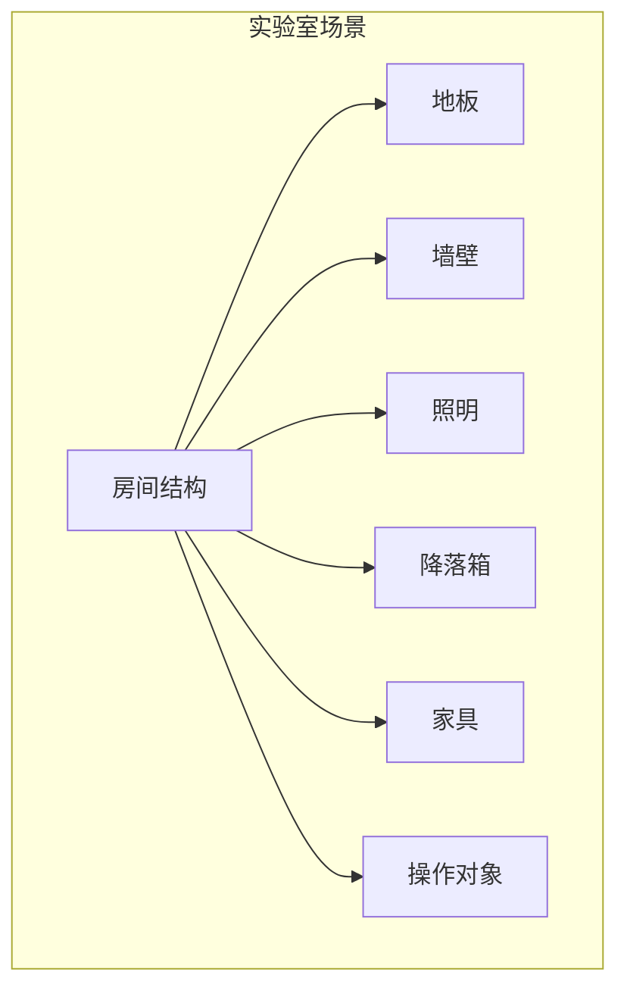

# 场景世界

VisionFlow-PX4 提供 8 个 Gazebo 仿真场景，覆盖从室内实验室到户外海岸的多种环境。

## 场景列表

| 场景文件 | 说明 | 默认使用平台 |
|---------|------|------------|
| `laboratory_landingbox.sdf` | 主实验室，带降落箱 | q940_ti_gripper4 |
| `laboratory_landingbox_vla_task0.sdf` | 带 VLA 任务的实验室 | q940_ti_gripper4 |
| `laboratory_no_landingbox.sdf` | 不带降落箱的实验室 | swan_gamma |
| `laboratory_no_landingbox_vla_task0.sdf` | 不带降落箱的 VLA 场景 | swan_gamma |
| `indoor_dining.sdf` | 室内餐厅环境 | 通用 |
| `baylands_coast.sdf` | 湾区海岸户外环境 | 通用 |
| `laboratory_landingbox_hitl.sdf` | 硬件在环版本 | q940_ti_hitl |
| `yungu.sdf` | Yungu 环境（glb 视觉 + STL 碰撞体） | 通用 |

## 实验室场景结构



### 主要组件

- **房间结构** — 墙壁、地板、天花板构成的室内空间
- **降落箱** — 带有视觉标记的降落目标，用于精确着陆测试
- **家具** — 书架、抽屉、桌子等室内设施
- **操作对象** — 可乐罐、饼干盒、魔方等用于机械臂操作测试的对象

## 启动场景

### 通过 Docker

```bash
bash docker/run_gz_sitl.sh --profile "Entity 1"  # laboratory_landingbox
bash docker/run_gz_sitl.sh --profile "Entity 4"  # laboratory_no_landingbox
bash docker/run_gz_sitl.sh --profile "Entity 8"  # yungu
```

### 通过本地命令

```bash
PX4_GZ_WORLD=laboratory_landingbox \
  make px4_sitl gz_q940_ti_gripper4_laboratory_landingbox \
  EXTRA_CMAKE_ARGS="-DENABLE_LOCKSTEP_SCHEDULER=ON"

# Yungu 环境
PX4_GZ_WORLD=yungu \
  make px4_sitl gz_q940_ti_gripper4_yungu \
  EXTRA_CMAKE_ARGS="-DENABLE_LOCKSTEP_SCHEDULER=ON"
```

## 场景工具

### 修复 SDF URI

```bash
python3 Tools/simulation/gz/worlds/tools/fix_sdf_uri.py
```

用于修复场景文件中模型引用的 URI 路径问题。

## 下一步

- [实验室降落箱场景详解](laboratory-landingbox.md)
- [实验室无降落箱场景](laboratory-no-landingbox.md)
- [VLA 任务场景](vla-tasks.md)
- [室内餐厅场景](indoor-dining.md)
- [湾区海岸场景](baylands-coast.md)
